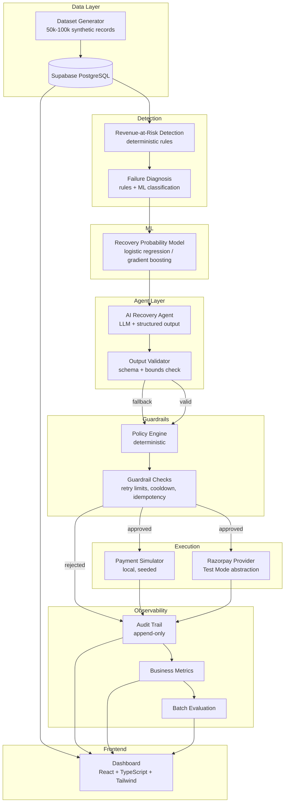

# Architecture

## System Overview



## Module Separation

### Deterministic vs AI

| Module | Type | Rationale |
|--------|------|-----------|
| Dataset Generator | Deterministic | Reproducible seeded generation |
| Revenue-at-Risk Detection | Deterministic rules | Transparent, auditable |
| Failure Diagnosis | Rules + ML | Rules for clear cases, ML for ambiguous |
| Recovery Probability Model | ML | Interpretable model (logistic regression / GBDT) |
| AI Recovery Agent | LLM | Selects from closed action set |
| Output Validator | Deterministic | Schema + bounds validation, safe fallback |
| Policy Engine | Deterministic | Non-negotiable guardrails |
| Payment Simulator | Deterministic | Seeded, reproducible |
| Audit Trail | Deterministic | Append-only event log |
| Metrics / Evaluation | Deterministic | Computed from actual results |

### Data Flow

1. **Dataset Generator** produces synthetic transactions → stored in PostgreSQL
2. **Revenue-at-Risk Detection** scans transactions for recoverable revenue
3. **Failure Diagnosis** classifies the failure type
4. **Recovery Probability Model** estimates P(recovery | context)
5. **AI Recovery Agent** receives structured context → returns action + confidence
6. **Output Validator** checks schema and bounds → falls back to deterministic if invalid
7. **Policy Engine** evaluates the proposed action against all guardrails
8. If approved → **Payment Simulator** (or Razorpay Test Mode) executes
9. If rejected → logged with reason
10. **Audit Trail** records every decision and action
11. **Business Metrics** aggregate results
12. **Dashboard** displays real data from the backend

## Repository Structure

```
/
├── src/                    # Frontend (React + TypeScript + Tailwind)
│   ├── components/         # UI components
│   ├── pages/              # Dashboard pages
│   ├── lib/                # Client-side utilities
│   └── types/              # Shared TypeScript types
├── lib/                    # Core backend logic (shared)
│   ├── dataset/            # Synthetic data generator
│   ├── detection/          # Revenue-at-risk + failure diagnosis
│   ├── ml/                 # Recovery probability model
│   ├── agent/              # AI recovery agent + output validation
│   ├── policy/             # Deterministic policy engine + guardrails
│   ├── simulator/          # Local payment simulator
│   ├── audit/              # Audit trail
│   ├── razorpay/           # Razorpay provider abstraction
│   └── evaluation/         # Batch evaluation pipeline
├── supabase/
│   ├── migrations/         # SQL migrations
│   └── functions/          # Edge functions
├── scripts/                # CLI scripts (generate, evaluate, simulate)
├── tests/                  # Automated tests
├── docs/                   # Documentation
└── .env.example            # Environment template
```

## Technology Choices

| Layer | Technology | Justification |
|-------|-----------|---------------|
| Frontend | React + TypeScript + Tailwind | Fast iteration, type safety, consistent styling |
| Backend | TypeScript (shared with frontend) | Single language across stack, type sharing |
| Database | Supabase (PostgreSQL) | Managed Postgres with RLS, real-time, auth |
| ML | TypeScript implementation | Simpler deployment, interpretable models, no Python dependency for core logic |
| AI Agent | Configurable LLM provider | OpenAI-compatible API, can swap providers |
| Simulator | TypeScript (seeded PRNG) | Reproducible, no external dependency |
| Tests | Vitest | Native Vite integration, fast |
| Docs | Markdown + Mermaid | Version-controlled, renderable on GitHub |
